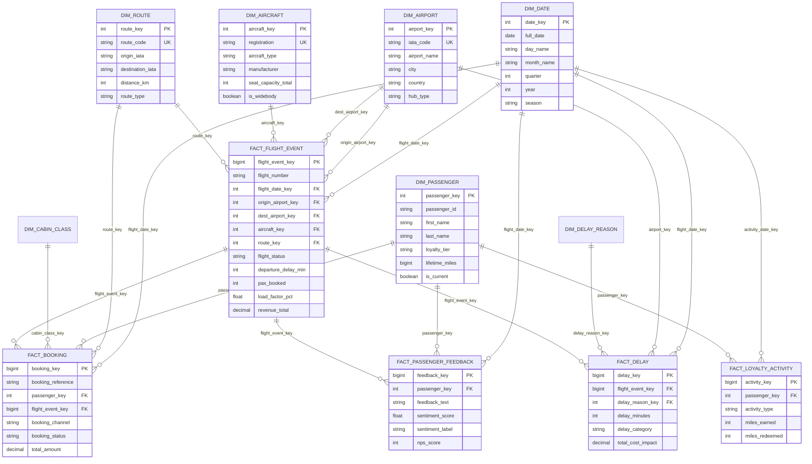

# SkyPulse AI — Entity Relationship Diagram

## Medallion Architecture Overview

```
┌─────────────────────────────────────────────────────────────────────────────────┐
│                          SNOWFLAKE AI DATA CLOUD                                 │
├─────────────────────────────────────────────────────────────────────────────────┤
│                                                                                  │
│  ┌──────────────┐      ┌──────────────────┐      ┌────────────────────────┐    │
│  │    BRONZE    │      │      SILVER      │      │         GOLD           │    │
│  │  (Raw/Land) │ ───► │  (Star Schema)   │ ───► │  (Dynamic Tables/ML)   │    │
│  └──────────────┘      └──────────────────┘      └────────────────────────┘    │
│                                                                                  │
│  7 Raw Tables           9 Dims + 5 Facts          5 Dynamic Tables              │
│  VARIANT/JSON           Typed, Validated          Auto-Refreshing               │
│  Append-Only            SCD Type 2                Real-Time Aggregates           │
│  90-Day Retention       PII Tagged                ML Features                    │
│                                                                                  │
└─────────────────────────────────────────────────────────────────────────────────┘
```

---

## Silver Layer — Star Schema ER Diagram

```
                              ┌─────────────────┐
                              │    DIM_DATE      │
                              ├─────────────────┤
                              │ PK date_key     │
                              │    full_date    │
                              │    day_name     │
                              │    month_name   │
                              │    quarter      │
                              │    year         │
                              │    season       │
                              │    is_weekend   │
                              └────────┬────────┘
                                       │
           ┌───────────────────────────┼───────────────────────────┐
           │                           │                           │
           ▼                           ▼                           ▼
┌─────────────────┐         ┌─────────────────────────────────────────────────┐
│  DIM_AIRPORT    │         │              FACT_FLIGHT_EVENT                   │
├─────────────────┤         ├─────────────────────────────────────────────────┤
│ PK airport_key  │◄────────│ PK flight_event_key                             │
│    iata_code    │         │ FK flight_date_key ──────► DIM_DATE             │
│    airport_name │         │ FK origin_airport_key ───► DIM_AIRPORT          │
│    city         │         │ FK dest_airport_key ─────► DIM_AIRPORT          │
│    country      │         │ FK aircraft_key ─────────► DIM_AIRCRAFT         │
│    region       │         │ FK route_key ────────────► DIM_ROUTE            │
│    timezone     │         │    flight_number                                │
│    hub_type     │         │    scheduled_departure                          │
└─────────────────┘         │    actual_departure                             │
                            │    flight_status                                │
┌─────────────────┐         │    departure_delay_min                          │
│  DIM_AIRCRAFT   │         │    arrival_delay_min                            │
├─────────────────┤         │    pax_booked                                   │
│ PK aircraft_key │◄────────│    pax_flown                                    │
│    registration │         │    seat_capacity                                │
│    aircraft_type│         │    load_factor_pct                              │
│    manufacturer │         │    revenue_total                                │
│    seat_capacity│         │    fuel_consumed_kg                             │
│    is_widebody  │         └──────────────────┬──────────────────────────────┘
│    engine_type  │                            │
│    status       │                            │ 1:N
└─────────────────┘                            │
                                               ▼
┌─────────────────┐         ┌─────────────────────────────────────────────────┐
│  DIM_ROUTE      │         │              FACT_BOOKING                        │
├─────────────────┤         ├─────────────────────────────────────────────────┤
│ PK route_key    │◄────────│ PK booking_key                                  │
│    route_code   │         │ FK passenger_key ────────► DIM_PASSENGER         │
│    origin_iata  │         │ FK flight_event_key ─────► FACT_FLIGHT_EVENT     │
│    dest_iata    │         │ FK route_key ────────────► DIM_ROUTE             │
│    distance_km  │         │ FK flight_date_key ──────► DIM_DATE              │
│    route_type   │         │ FK cabin_class_key ──────► DIM_CABIN_CLASS       │
│    market_type  │         │ FK origin_airport_key ───► DIM_AIRPORT           │
│    is_seasonal  │         │ FK dest_airport_key ─────► DIM_AIRPORT           │
└─────────────────┘         │    booking_reference                             │
                            │    booking_channel                               │
┌─────────────────┐         │    booking_status                                │
│ DIM_CABIN_CLASS │         │    fare_amount                                   │
├─────────────────┤         │    total_amount                                  │
│ PK cabin_class_ │◄────────│    ancillary_revenue                             │
│    key          │         │    days_before_departure                         │
│    cabin_code   │         └─────────────────────────────────────────────────┘
│    cabin_name   │
│    service_level│
└─────────────────┘

┌─────────────────────┐     ┌─────────────────────────────────────────────────┐
│  DIM_PASSENGER      │     │              FACT_DELAY                           │
│  (SCD Type 2)       │     ├─────────────────────────────────────────────────┤
├─────────────────────┤     │ PK delay_key                                    │
│ PK passenger_key    │     │ FK flight_event_key ─────► FACT_FLIGHT_EVENT     │
│    passenger_id     │     │ FK flight_date_key ──────► DIM_DATE              │
│    first_name   [PII]     │ FK airport_key ──────────► DIM_AIRPORT           │
│    last_name    [PII]     │ FK delay_reason_key ─────► DIM_DELAY_REASON      │
│    email        [PII]     │    delay_minutes                                 │
│    phone        [PII]     │    delay_category                                │
│    date_of_birth[PII]     │    pax_affected                                  │
│    loyalty_tier      │     │    compensation_amount                           │
│    lifetime_miles    │     │    rebooking_cost                                │
│    ytd_miles         │     │    total_cost_impact                             │
│    effective_from    │     │    caused_missed_connections                     │
│    effective_to      │     └─────────────────────────────────────────────────┘
│    is_current        │
└──────────┬───────────┘    ┌─────────────────────────────────────────────────┐
           │                │          FACT_PASSENGER_FEEDBACK                  │
           │                ├─────────────────────────────────────────────────┤
           ├───────────────►│ PK feedback_key                                  │
           │                │ FK passenger_key ────────► DIM_PASSENGER          │
           │                │ FK flight_event_key ─────► FACT_FLIGHT_EVENT      │
           │                │ FK flight_date_key ──────► DIM_DATE               │
           │                │ FK route_key ────────────► DIM_ROUTE              │
           │                │    feedback_channel                               │
           │                │    feedback_text                                  │
           │                │    nps_score                                      │
           │                │    sentiment_score   [AI-generated]               │
           │                │    sentiment_label   [AI-generated]               │
           │                │    ai_summary        [AI-generated]               │
           │                └─────────────────────────────────────────────────┘
           │
           │                ┌─────────────────────────────────────────────────┐
           │                │          FACT_LOYALTY_ACTIVITY                    │
           │                ├─────────────────────────────────────────────────┤
           └───────────────►│ PK activity_key                                  │
                            │ FK passenger_key ────────► DIM_PASSENGER          │
                            │ FK activity_date_key ────► DIM_DATE               │
                            │    activity_type                                  │
                            │    miles_earned                                   │
                            │    miles_redeemed                                 │
                            │    monetary_value                                 │
                            └─────────────────────────────────────────────────┘

┌─────────────────────┐
│  DIM_DELAY_REASON   │
├─────────────────────┤     ┌─────────────────────────────────────────────────┐
│ PK delay_reason_key │     │              DIM_WEATHER                          │
│    iata_delay_code  │     ├─────────────────────────────────────────────────┤
│    delay_category   │     │ PK weather_key                                   │
│    delay_subcategory│     │    airport_iata                                  │
│    is_airline_fault │     │    observation_time                              │
│    is_controllable  │     │    temperature_c                                 │
└─────────────────────┘     │    wind_speed_kts                                │
                            │    visibility_km                                  │
                            │    weather_condition                              │
                            │    severity                                       │
                            │    is_deicing_required                            │
                            └─────────────────────────────────────────────────┘
```

---

## Gold Layer — Dynamic Tables & ML

```
┌─────────────────────────────────────────────────────────────────────────────┐
│                           GOLD LAYER                                          │
├─────────────────────────────────────────────────────────────────────────────┤
│                                                                              │
│  ┌─────────────────────┐  ┌─────────────────────┐  ┌────────────────────┐  │
│  │  DT_FLIGHT_STATUS   │  │  DT_PASSENGER_RISK  │  │  DT_OPS_ANOMALY   │  │
│  │  (refreshes: 1 min) │  │  (refreshes: 1 hr)  │  │  (refreshes: 5m)  │  │
│  ├─────────────────────┤  ├─────────────────────┤  ├────────────────────┤  │
│  │ flight_number       │  │ passenger_id        │  │ flight_number      │  │
│  │ origin → destination│  │ loyalty_tier        │  │ anomaly_type       │  │
│  │ flight_status       │  │ churn_risk_level    │  │ severity           │  │
│  │ delay_severity      │  │ days_since_booking  │  │ departure_delay    │  │
│  │ load_factor_pct     │  │ avg_sentiment       │  │ detected_at        │  │
│  │ aircraft_type       │  │ revenue_last_90d    │  │                    │  │
│  └─────────────────────┘  └─────────────────────┘  └────────────────────┘  │
│                                                                              │
│  ┌─────────────────────┐  ┌─────────────────────┐  ┌────────────────────┐  │
│  │ DT_ROUTE_PERFORMANCE│  │    DT_DAILY_KPI     │  │    ALERT_LOG       │  │
│  │ (refreshes: 1 day)  │  │  (refreshes: 30m)   │  │  (task-generated)  │  │
│  ├─────────────────────┤  ├─────────────────────┤  ├────────────────────┤  │
│  │ route_code          │  │ total_flights       │  │ alert_type         │  │
│  │ otp_15min_pct       │  │ otp_pct             │  │ severity           │  │
│  │ avg_load_factor     │  │ avg_delay_min       │  │ flight_number      │  │
│  │ total_revenue       │  │ total_passengers    │  │ message            │  │
│  │ delay_costs         │  │ total_revenue       │  │ created_at         │  │
│  │ avg_sentiment       │  │ avg_nps             │  │                    │  │
│  └─────────────────────┘  └─────────────────────┘  └────────────────────┘  │
│                                                                              │
└─────────────────────────────────────────────────────────────────────────────┘
```

---

## ML Schema — Trained Models & Features

```
┌─────────────────────────────────────────────────────────────────────────────┐
│                           ML LAYER                                            │
├─────────────────────────────────────────────────────────────────────────────┤
│                                                                              │
│  CORTEX ML MODELS (Trained)         CORTEX AI FUNCTIONS (Built-in)           │
│  ─────────────────────────          ─────────────────────────────            │
│  • DELAY_FORECAST_MODEL             • SNOWFLAKE.CORTEX.SENTIMENT()           │
│  • DEMAND_FORECAST_MODEL            • SNOWFLAKE.CORTEX.SUMMARIZE()           │
│  • REVENUE_FORECAST_MODEL           • SNOWFLAKE.CORTEX.COMPLETE()            │
│  • DELAY_ANOMALY_MODEL              • SNOWFLAKE.CORTEX.TRANSLATE()           │
│  • FUEL_ANOMALY_MODEL               • SNOWFLAKE.CORTEX.EXTRACT_ANSWER()     │
│  • CHURN_PREDICTION_MODEL                                                    │
│  • CANCELLATION_PREDICTION_MODEL    CUSTOM FUNCTIONS                         │
│                                     ─────────────────                        │
│  RESULT TABLES                      • CALCULATE_DELAY_RISK (Python UDF)      │
│  ─────────────────                  • GENERATE_PASSENGER_FEATURES (UDTF)     │
│  • DELAY_FORECAST_RESULTS           • BUILD_ML_FEATURES (Stored Proc)        │
│  • DEMAND_FORECAST_RESULTS          • OPS_CHATBOT (SQL UDF)                  │
│  • REVENUE_FORECAST_RESULTS                                                  │
│  • DELAY_ANOMALY_RESULTS                                                     │
│  • FUEL_ANOMALY_RESULTS                                                      │
│                                                                              │
└─────────────────────────────────────────────────────────────────────────────┘
```

---

## Data Flow Diagram

```
  EXTERNAL SOURCES                    SNOWFLAKE PROCESSING                    CONSUMERS
  ────────────────                    ─────────────────                    ──────────

  Flight OPS API  ──┐                ┌─────────┐   ┌──────────┐
  Booking System  ──┤  ──Streams──►  │ BRONZE  │──►│  SILVER  │──┐
  Passenger CRM   ──┤                │  (Raw)  │   │  (Star)  │  │     ┌──────────────┐
  Weather API     ──┤                └─────────┘   └──────────┘  ├────►│  Ops Team    │
  Feedback Forms  ──┤                                    │       │     │  (Dashboards)│
  IoT Sensors     ──┘                                    │       │     └──────────────┘
                                                         ▼       │
                                                   ┌──────────┐  │     ┌──────────────┐
                                    ┌─Tasks────►   │   GOLD   │──┼────►│  Executives  │
                                    │              │(Dynamic) │  │     │  (KPIs)      │
                                    │              └──────────┘  │     └──────────────┘
                                    │                    │       │
                                    │                    ▼       │     ┌──────────────┐
                              ┌──────────┐        ┌──────────┐  ├────►│  Data Science│
                              │  Cortex  │◄───────│    ML    │──┘     │  (Models)    │
                              │    AI    │        │ (Models) │        └──────────────┘
                              └──────────┘        └──────────┘
                                    │                                  ┌──────────────┐
                                    ▼                                  │  Partner     │
                              ┌──────────┐                        ┌──►│  Airports    │
                              │  Alerts  │──► Ops Notifications   │   │  (Shares)    │
                              └──────────┘                        │   └──────────────┘
                                                                  │
                              ┌──────────┐                        │
                              │  Shares  │────────────────────────┘
                              └──────────┘
```

---

## Mermaid Diagram (paste into mermaid.live for rendered view)


